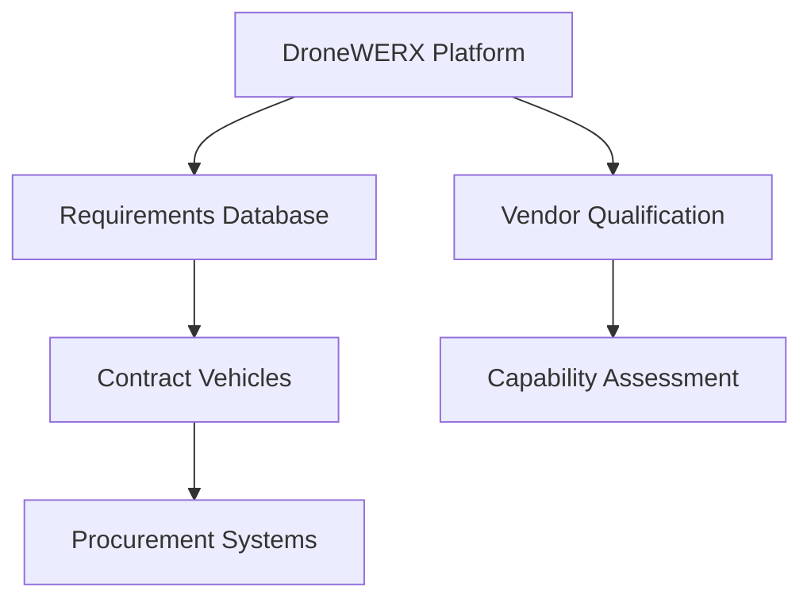

# DroneWERX White List Platform - Future Roadmap

## Current Status: Phase 1 Complete ✅

### Delivered Capabilities
- ✅ Secure challenge submission with DoD verification
- ✅ Community voting and discussion system
- ✅ OPSEC-compliant moderation workflows
- ✅ Classification-based access control (Red/Yellow/Green)
- ✅ Real-time collaboration features
- ✅ Searchable challenge archive
- ✅ Video submission support
- ✅ Anonymous posting capabilities
- ✅ Tamper-evident audit logging

## Phase 2: Enhanced Intelligence (Q3-Q4 2024)

### 🎯 Vector-Powered Smart Matching
**Objective:** Implement AI-driven challenge-solution matching

**Key Features:**
- **Semantic Search:** pgvector-based similarity matching
- **Auto-Suggestions:** Recommend relevant past solutions
- **Challenge Clustering:** Group related problems automatically
- **Expert Matching:** Connect challenges with specialist providers

**Technical Implementation:**
```typescript
// Smart matching engine
const suggestedSolutions = await findSimilarChallenges(
  challengeEmbedding,
  { threshold: 0.8, maxResults: 5 }
);
```

**Success Metrics:**
- 80% reduction in duplicate challenge submissions
- 50% faster solution discovery
- 90% user satisfaction with recommendations

### 🎯 Advanced Analytics Dashboard
**Objective:** Provide actionable insights for military leadership

**Key Features:**
- **Capability Gap Analysis:** Identify recurring problem patterns
- **Solution Success Tracking:** Monitor implementation outcomes
- **Innovation Metrics:** Measure platform impact on acquisition
- **Predictive Analytics:** Forecast emerging challenge domains

**Deliverables:**
- Executive dashboard for military leadership
- Domain-specific capability gap reports
- Solution provider performance analytics
- ROI calculation framework

### 🎯 Enhanced Security Features
**Objective:** Strengthen security posture for classified operations

**Key Features:**
- **CAC/PIV Integration:** Hardware-based authentication
- **Classification Auto-Detection:** ML-powered content analysis
- **Secure Enclaves:** Isolated environments for sensitive discussions
- **Zero-Trust Architecture:** Continuous verification framework

## Phase 3: Enterprise Integration (Q1-Q2 2025)

### 🎯 Acquisition System Integration
**Objective:** Bridge platform to formal procurement processes

**Key Features:**
- **Contract Vehicle Integration:** Direct connection to SEWP, CIO-SP3
- **Requirements Traceability:** Link challenges to formal RFPs
- **Vendor Qualification:** Automated capability assessment
- **Budget Integration:** Cost estimation and funding identification

**Technical Architecture:**


### 🎯 PDF Mission Brief Generator
**Objective:** Automated documentation for operational use

**Key Features:**
- **One-Page Summaries:** Concise challenge and solution briefs
- **Classification Markings:** Automatic security labeling
- **Distribution Control:** Automated need-to-know enforcement
- **Template Customization:** Service-specific formatting

**Implementation:**
- Serverless PDF generation (Puppeteer/Chrome)
- Military standard templates (MIL-STD-40051)
- Digital signature integration
- Secure distribution tracking

### 🎯 International Collaboration
**Objective:** Extend platform to allied nations

**Key Features:**
- **Multi-National User Management:** Country-specific access controls
- **Translation Services:** Real-time language translation
- **Export Control Compliance:** ITAR/EAR automated screening
- **Bilateral Data Sharing:** Nation-to-nation agreements

## Phase 4: AI-Powered Innovation (Q3-Q4 2025)

### 🎯 Autonomous Challenge Generation
**Objective:** Proactive identification of capability gaps

**Key Features:**
- **Threat Analysis Integration:** Convert intelligence to challenges
- **Doctrine Gap Detection:** Analyze military publications
- **Technology Trend Monitoring:** Predict future requirements
- **Scenario Simulation:** War-game derived challenges

**AI Components:**
```python
# Capability gap detector
def detect_capability_gaps(doctrine_corpus, threat_intel):
    gaps = analyze_doctrine_coverage(doctrine_corpus)
    threats = process_threat_intelligence(threat_intel)
    return correlate_gaps_with_threats(gaps, threats)
```

### 🎯 Solution Quality Prediction
**Objective:** ML-powered solution assessment

**Key Features:**
- **TRL Prediction:** Estimate technology readiness automatically
- **Success Probability:** Calculate implementation likelihood
- **Risk Assessment:** Identify potential failure modes
- **Cost Estimation:** Predict development and deployment costs

### 🎯 Adaptive Learning System
**Objective:** Platform that improves with usage

**Key Features:**
- **User Behavior Learning:** Personalized challenge recommendations
- **Solution Effectiveness Tracking:** Learn from implementation outcomes
- **Community Evolution:** Adapt to changing user needs
- **Feedback Loop Integration:** Continuous improvement based on results

## Phase 5: Next-Generation Capabilities (2026+)

### 🎯 Virtual Reality Collaboration
**Objective:** Immersive problem-solving environments

**Key Features:**
- **3D Challenge Visualization:** Spatial problem representation
- **Virtual Prototyping:** Shared 3D solution modeling
- **Remote Collaboration:** Multi-user virtual environments
- **Haptic Feedback:** Tactile solution interaction

### 🎯 Quantum-Secured Communications
**Objective:** Future-proof security architecture

**Key Features:**
- **Quantum Key Distribution:** Unbreakable encryption
- **Post-Quantum Cryptography:** Quantum-resistant algorithms
- **Distributed Ledger:** Blockchain-based audit trails
- **Zero-Knowledge Proofs:** Privacy-preserving verification

### 🎯 Autonomous Solution Development
**Objective:** AI agents that develop solutions

**Key Features:**
- **Code Generation:** Automated software solution creation
- **Design Optimization:** AI-driven engineering solutions
- **Simulation Integration:** Automated testing and validation
- **Continuous Evolution:** Self-improving solution agents

## Military Compatibility Roadmap

### Current: NIPR Compatibility ✅
- Unclassified network deployment
- Basic security controls
- Standard authentication

### Q4 2024: SIPR Integration 🔄
- Secret network deployment
- Enhanced security controls
- CAC/PIV authentication
- Classified data handling

### Q2 2025: Multi-Level Security 🔄
- Cross-domain solutions
- Automated declassification
- Guard integration
- Multi-classification workflows

### 2026+: Next-Gen Networks 🔄
- Tactical edge computing
- Mesh networking support
- Satellite communication
- Contested environment operation

## Success Metrics & KPIs

### Phase 2 Targets
- **User Growth:** 25,000 active users
- **Challenge Resolution:** 70% faster than baseline
- **Solution Quality:** 85% implementation success rate
- **Security Compliance:** Zero OPSEC violations

### Phase 3 Targets
- **Acquisition Integration:** 50% of solutions enter formal procurement
- **International Adoption:** 5 allied nations active
- **Commercial Success:** $10M revenue from commercial licenses
- **Innovation Impact:** 200 patents filed from platform collaborations

### Phase 4 Targets
- **AI Accuracy:** 95% correct challenge-solution matching
- **Predictive Capability:** 80% accuracy in capability gap prediction
- **Autonomous Generation:** 30% of challenges AI-generated
- **Global Impact:** 50+ nations using platform variants

## Investment Requirements

### Phase 2: $2.5M
- AI/ML engineering team (6 FTE)
- Vector database infrastructure
- Advanced analytics development
- Security enhancement implementation

### Phase 3: $5M
- Enterprise integration team (10 FTE)
- International expansion resources
- Compliance and legal framework
- Advanced infrastructure scaling

### Phase 4: $10M
- AI research and development (15 FTE)
- Quantum security research
- Advanced simulation capabilities
- Global deployment infrastructure

### Phase 5: $20M
- Next-generation technology research
- VR/AR development team
- Quantum computing integration
- Autonomous system development

## Risk Mitigation Strategy

### Technical Risks
- **Scalability Challenges:** Microservices architecture, cloud-native design
- **AI Bias Issues:** Diverse training data, fairness monitoring
- **Security Vulnerabilities:** Continuous security assessment, bug bounty programs
- **Integration Complexity:** Phased rollout, extensive testing

### Operational Risks
- **User Adoption:** Extensive training, champion programs
- **Content Quality:** Community moderation, expert review panels
- **Regulatory Changes:** Legal monitoring, adaptive compliance
- **International Tensions:** Flexible architecture, rapid reconfiguration

### Strategic Risks
- **Competing Platforms:** Unique value proposition, network effects
- **Budget Constraints:** Commercial revenue diversification
- **Technology Obsolescence:** Continuous innovation, platform flexibility
- **Mission Creep:** Clear scope definition, stakeholder alignment

## Partnership Strategy

### Government Partners
- **DoD Innovation Offices:** DIU, AFWERX, Army Futures Command
- **Intelligence Community:** CIA, NSA, DIA innovation arms
- **International Allies:** NATO, Five Eyes intelligence sharing
- **Academic Research:** FFRDC partnerships, university consortiums

### Commercial Partners
- **Cloud Providers:** AWS GovCloud, Azure Government, Google Cloud
- **Security Vendors:** Palantir, Raytheon, Lockheed Martin
- **AI Companies:** Anthropic, OpenAI, Stability AI
- **System Integrators:** CACI, SAIC, Booz Allen Hamilton

### Technology Partners
- **Open Source Communities:** Supabase, React, Tailwind
- **Standards Bodies:** IEEE, NIST, ISO
- **Research Institutions:** MIT Lincoln Lab, RAND Corporation
- **Innovation Hubs:** Silicon Valley, Austin, Boston

## Conclusion

The DroneWERX White List Platform roadmap represents a comprehensive evolution from a collaborative problem-solving tool to a next-generation innovation ecosystem. Each phase builds upon previous capabilities while introducing transformative new features that enhance military effectiveness, accelerate innovation, and strengthen partnerships between military and civilian sectors.

Success will require sustained investment, strong partnerships, and unwavering commitment to security and user needs. The platform's ultimate goal is to become the primary catalyst for military innovation, ensuring that warfighters have access to the best solutions available while maintaining the highest standards of operational security and mission effectiveness.
